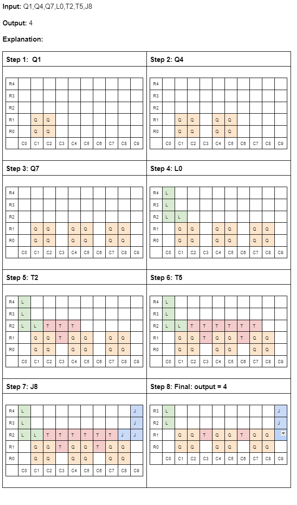

# Tetris - Building a basic Tetris Game 
Basics of Tetris game to get the maximum height of the resulting stack of the blocks

Derived the solution from https://github.com/daniel-chuang/tetris/tree/main

## Dependencies: 
Could implement this with numpy for better performance
Kept the implementation simple

argparse 

## Assumptions:
1. No rotation
2. No translation
3. input blocks do not fall out of bound from the grid
4. width = 10
5. height = 100

## options:
  `-h, --help            show this help message and exit`

  `-i INPUT, --input INPUT
                        Input file path, defaults to input.txt in current folder`

  `-o OUTPUT, --output OUTPUT
                        Output file path, defaults to output.txt in current folder`

  `-wt GRID_WIDTH, --grid_width GRID_WIDTH
                        Input file path, defaults to input.txt in current folder`

  `-ht GRID_HEIGHT, --grid_height GRID_HEIGHT
                        Output file path, defaults to output.txt in current folder`

## TO RUN the code:
No reason for this code to run in a virtual env 
if you are using python 3.2 or above
argparse is now part of the python in-built packages else install argparse

`python3 main.py -i input.txt -o output.txt`

## TO RUN TEST CASES:
`python3 test_tetris.py`

## Example illustration

## Extensions/Future work
1. Add pygame to visualize the blocks move
2. Add options to move the block while the block drops very 0.5 seconds
3. Add options to rotate the block clockwise/counter-clockwise while the block drops very 0.5 seconds
4. Add some scoring scheme to make it fun

